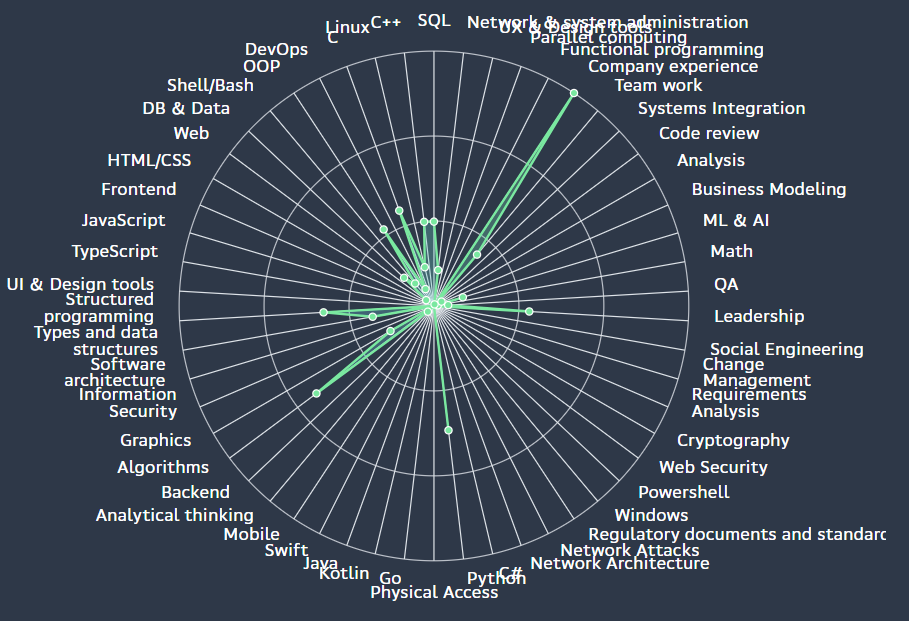
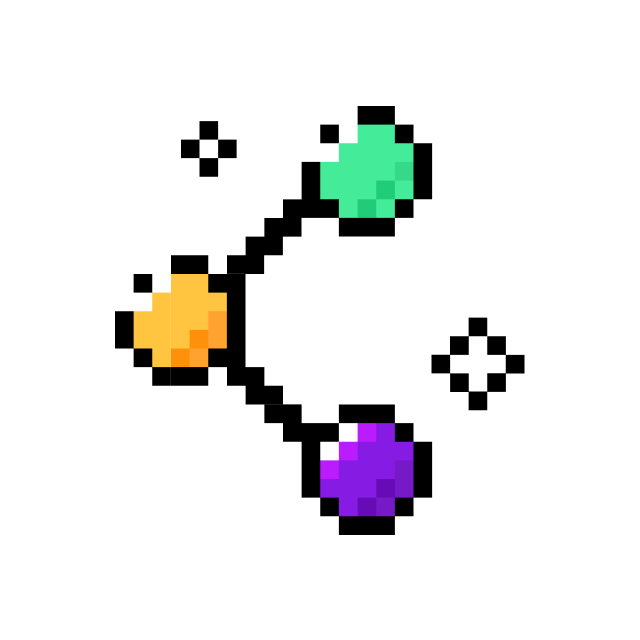

#

<!-- School 21 Logo -->

    

## About *School 21*

**School 2️⃣1️⃣** (the analogue of the *School 4️⃣2️⃣*) — is a free digital
technology school.
It offers: free and non-profit education without: traditional teachers, lessons,
grades.
Students learn teamwork and project activities.

## Repository Description

A repository is a collection of completed *School 2️⃣1️⃣* projects.

## Production readiness

This repo is undergoing a production-grade overhaul (2026-05). Live status:

- **Top-level dashboard:** [`STATUS.md`](STATUS.md) — production-readiness matrix
  for all 37 subprojects across 8 Definition-of-Done items.
- **Per-subproject plans:** [`docs/plans/`](docs/plans/) — checklist + history
  per subproject.
- **Design doc:** [`docs/specs/2026-05-11-production-grade-overhaul.md`](docs/specs/2026-05-11-production-grade-overhaul.md).
- **Working agreement:** [`CLAUDE.md`](CLAUDE.md) — repo-wide rules and conventions.
- **AI-coding-agent contract:** [`AGENTS.md`](AGENTS.md) — public counterpart of CLAUDE.md, read by Copilot CLI / Cursor / Aider on session start.
- **Security policy:** [`SECURITY.md`](SECURITY.md) — how to report vulnerabilities + the three-layer leak-prevention stack (gitleaks pre-commit + secrets.yml CI + bandit + pip-audit).
- **Dev shortcuts:** [`Makefile`](Makefile) — `make install` (pre-commit + dev tooling), `make precommit-all` (run every hook), `make lint-{md,shell,python,cpp,sql,secrets}` for the per-language gates. `make help` lists every target.
- **Toolchain pins:** [`docs/TOOLCHAIN.md`](docs/TOOLCHAIN.md) — every language / linter / framework version, single source of truth.
- **Changelog:** [`CHANGELOG.md`](CHANGELOG.md) — Keep-a-Changelog record of the 2026-05-11 production-grade overhaul.
- **Generated docs site:** [erdogan-deniz.github.io/school-21](https://erdogan-deniz.github.io/school-21/) — Doxygen + Sphinx HTML, built and deployed by [`pages.yml`](.github/workflows/pages.yml).

## Repository Source File Structure

- [`algorithms/`](algorithms/), [`c/`](c/), [`career_track/`](career_track/), [`cpp/`](cpp/), [`data_science/`](data_science/), [`devops/`](devops/), [`internship/`](internship/), [`machine_learning/`](machine_learning/), [`python/`](python/), [`qa/`](qa/), [`sql/`](sql/), [`survival_camp/`](survival_camp/) — language / track folders, each with one or more subprojects.
- [`content/`](content/) — materials for the repo's design (badge images) and templates ([`content/templates/SUBPROJECT_README.md`](content/templates/SUBPROJECT_README.md)).
- [`docs/`](docs/) — design specs and per-subproject plans.
- [`.github/workflows/`](.github/workflows/) — 8 CI workflows (lint, c, cpp, python, sql, devops, docs, pages).
- [`CLAUDE.md`](CLAUDE.md), [`STATUS.md`](STATUS.md), [`LICENSE`](LICENSE), [`.clang-format`](.clang-format), [`.ruff.toml`](.ruff.toml), [`.gitignore`](.gitignore), [`.markdownlint.json`](.markdownlint.json) — repo-wide configuration and rules.
- `README.md`: the description file of the repository (you read it).

## About My Platform Account

### General Information

- Campus location: *Moscow*
- Wawe: 10.2022
- Nickname: *charisel*
- Program: *Core program*
- Level: 12
- XP: 20975
- *E-mail*: <charisel@student.21-school.ru>

### Acquired Skills

<!-- Acquired Skills Wheel Photo -->

| Skill Name: | Skill Points: |
|:------------:|:--------------------:|
| Math | 91 |
| *QA* | 400 |
| *C* | 1423 |
| *OOP* | 1284 |
| *C++* | 1188 |
| *SQL* | 1183 |
| DevOps | 264 |
| *Linux* | 558 |
| Backend | 153 |
| Analysis | 122 |
| Graphics | 704 |
| *Python* | 1936 |
| Team Work | 940 |
| DB & Data | 576 |
| *ML* & *AI* | 639 |
| Algorithms | 2091 |
| Leadership | 1339 |
| Web Development | 136 |
| *Shell* & *Bash* | 411 |
| Parallel Computing | 23 |
| Company Experience | 3574 |
| Information Security | 36 |
| Functional Programming | 180 |
| Structured Programming | 1551 |
| Types & Data Structures | 873 |
| Network & System Administration | 506 |

### Peers Feedback

- Nice: 4/4 😃
- Punctual: 4/4 ⏲
- Rigorous: 4/4 ⚖️
- Interested: 4/4 ❓

All peer reviews: 196

### Learning Badges

#### Education Progress

| Badge Name: | Badge Rank: | Badge Description: | Badge Image: |
|:-----------:|:-----------:|:------------------:|:------------:|
| *Real Programmer* | 5/5 | Successfully perform `50` projects. |  |
| *Perfectionist* | 5/5 | Successfully perform `21` projects with a bonus part. |  |
| *Mistakes Are Not For Me* | 5/5 | Successfully perform `21` projects in a row without failur. |  |
| *King Of Study* | - | Two badges for studies were obtained. |  |
| *Welcome On Board* | - | The *Survival Camp* was completed. |  |
| *Pollinator* | - | Successfully perform `15` group projects with `15` different partners in a team. |  |
| *3 PRP* | - | - |  |
| *Finale Exam Passed* | - | - |  |

#### Academic Activities

| Badge Name: | Badge Rank: | Badge Description: | Badge Image: |
|:-----------:|:-----------:|:------------------:|:------------:|
| *Such A Listener* | 5/5 | Visit `50` lectures`. |  |
| *Lead The World* | 3/5 | Be a team lead in `5` projects. |  |

#### Social Activities

| Badge Name: | Badge Rank: | Badge Description: | Badge Image: |
|:-----------:|:-----------:|:------------------:|:------------:|
| *Happy Halloween!* | - | BOOOO! |  |
| *Computer Security Day 2023* | - | Happy Cybersecurity Day! |  |
| *Harry New Year, Moscow!* | - | *Happy New Year*, our dear, beloved peers! |  |
| *Space Exploration Day* | - | As *Yuri Gagarin* once said: `Let's go!` |  |

#### Other

| Badge Name: | Badge Rank: | Badge Description: | Badge Image: |
|:-----------:|:-----------:|:------------------:|:------------:|
| *Billionaire* | 3/5 | Accumulate 500 coins. |  |
| *Happy Halloween!* | - | Happy Halloween! |  |
| *Happy Birthday, Moscow сampus!* | - | The *Moscow* campus of *School 21* has turned `5` years old! |  |
| *Happy birthday, Wave `16`!* | - | With love from ADM. |  |

#### Supporting

| Badge Name: | Badge Rank: | Badge Description: | Badge Image: |
|:-----------:|:-----------:|:------------------:|:------------:|
| *Will you be my peer?* | - | Love is *School 21*, which has become a second home! |  |

### About Me

- Telegram: @deniz_erdogan
- E-mail: <erdogan33@mail.ru>
- Specialization: Python backend developer & Data Scientist
