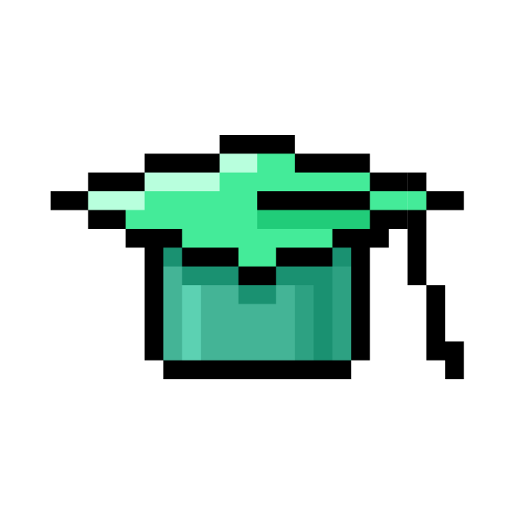

#

<!-- School 21 Logo -->

    

## About *School 21*

**School 2️⃣1️⃣** (the analogue of the *School 4️⃣2️⃣*) — is a free digital
technology school.
It offers: free and non-profit education without: traditional teachers, lessons,
grades.
Students learn teamwork and project activities.

## Repository Description

A repository is a collection of completed *School 2️⃣1️⃣* projects.

## Repository Source File Structure

- `content`: a folder with materials for the design of the repository and its
  elements.
- `project_clusters`: a folder with projects, where each project consists of
  small projects united by a theme.
- `projects`: a folder of projects, each of which represents a product.
- `.markdownlint.json`: the configuration file `README.md` file.
- `README.md`: the description file of the repository (you read it).

## About My Platform Account

### General Information

- Campus location: *Moscow*
- Wawe: 10.2022
- Nickname: *charisel*
- Program: *Core program*
- Level: 12
- XP: 20055
- *E-mail*: <charisel@student.21-school.ru>

### Acquired Skills

<!-- Acquired Skills Wheel Photo -->

| Skill Name: | Skill Points: |
|:------------:|:--------------------:|
| Math | 55 |
| *QA* | 200 |
| *C* | 1423 |
| *OOP* | 1284 |
| *C++* | 1188 |
| *SQL* | 1183 |
| DevOps | 264 |
| *Linux* | 558 |
| Backend | 117 |
| Analysis | 122 |
| Graphics | 704 |
| *Python* | 1756 |
| Team Work | 940 |
| DB & Data | 576 |
| *ML* & *AI* | 423 |
| Algorithms | 2055 |
| Leadership | 1339 |
| Web Development | 136 |
| *Shell* & *Bash* | 411 |
| Parallel Computing | 23 |
| Company Experience | 3574 |
| Structured Programming | 1551 |
| Types & Data Structures | 873 |
| Network & System Administration | 506 |

### Peers Feedback

- Nice: 4/4 😃
- Punctual: 4/4 ⏲
- Rigorous: 4/4 ⚖️
- Interested: 4/4 ❓

All peer reviews: 187

### Learning Badges

#### Education Progress

| Badge Name: | Badge Rank: | Badge Description: | Badge Image: |
|:-----------:|:-----------:|:------------------:|:------------:|
| *Real Programmer* | 5/5 | Successfully perform `50` projects. |  |
| *Perfectionist* | 5/5 | Successfully perform `21` projects with a bonus part. |  |
| *Mistakes Are Not For Me* | 5/5 | Successfully perform `21` projects in a row without failur. |  |
| *King Of Study* | - | Two badges for studies were obtained. |  |
| *Welcome On Board* | - | The *Survival Camp* was completed. |  |
| *Pollinator* | - | Successfully perform `15` group projects with `15` different partners in a team. |  |
| *3 PRP* | - | - |  |
| *Finale Exam Passed* | - | - |  |

#### Academic Activities

| Badge Name: | Badge Rank: | Badge Description: | Badge Image: |
|:-----------:|:-----------:|:------------------:|:------------:|
| *Such A Listener* | 5/5 | Visit `50` lectures`. |  |
| *Lead The World* | 3/5 | Be a team lead in `5` projects. |  |

#### Social Activities

| Badge Name: | Badge Rank: | Badge Description: | Badge Image: |
|:-----------:|:-----------:|:------------------:|:------------:|
| *Happy Halloween!* | - | BOOOO! |  |
| *Computer Security Day 2023* | - | Happy Cybersecurity Day! |  |
| *Harry New Year, Moscow!* | - | *Happy New Year*, our dear, beloved peers! |  |
| *Space Exploration Day* | - | As *Yuri Gagarin* once said: `Let's go!` |  |

#### Other

| Badge Name: | Badge Rank: | Badge Description: | Badge Image: |
|:-----------:|:-----------:|:------------------:|:------------:|
| *Billionaire* | 3/5 | Accumulate 500 coins. |  |
| *Happy Halloween!* | - | Happy Halloween! |  |
| *Happy Birthday, Moscow сampus!* | - | The *Moscow* campus of *School 21* has turned `5` years old! |  |
| *Happy birthday, Wave `16`!* | - | With love from ADM. |  |

#### Supporting

| Badge Name: | Badge Rank: | Badge Description: | Badge Image: |
|:-----------:|:-----------:|:------------------:|:------------:|
| *Will you be my peer?* | - | Love is *School 21*, which has become a second home! |  |

### About Me

Telegram: @deniz_erdogan

E-mail: <erdogan33@mail.ru>

Specialization: Python backend developer & Data Scientist
