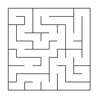
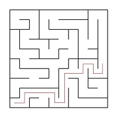
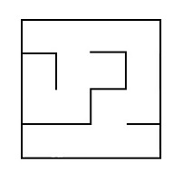
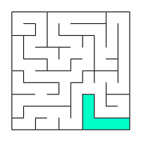
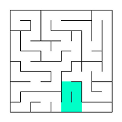
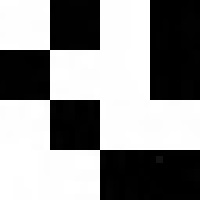

# `algorithms/python/maze`

[](https://github.com/Deniz211/school-21/actions/workflows/python.yml)
[](../../../LICENSE)

> *Python maze + cave generator/renderer/solver — Eller's algorithm for perfect mazes, cellular-automaton caves, A* / Q-learning agents, GUI + web interface.*

## Quick start

```bash
cd algorithms/python/maze

# Install in editable mode
pip install -e .

# Run the test suite (pytest)
pytest -v

# Lint (ruff respects the repo-wide .ruff.toml)
ruff check .

# Open the GUI (target depends on Makefile setup)
make all
```

For a fully reproducible environment, use Python 3.12 inside a Linux container —
see [`.github/workflows/python.yml`](../../../.github/workflows/python.yml) for
the canonical install line.

## Demo

> **TODO** — short asciinema cast of generating a 50×50 maze with Eller's algorithm and the Q-learning agent solving it is planned in the python/ Phase 2 demo slice.

## Documentation

- [Maze description](#maze-description), [Generation using a cellular automaton](#generation-using-a-cellular-automaton),
  [Caves description](#caves-description) sections below.
- Sphinx HTML docs: planned in the docs slice (Sphinx already in use elsewhere
  in the bootcamp — Day 07).
- API reference under `docs/`.

## Tests

- Framework: **pytest**.
- Coverage targets per task: maze generation module, maze solving module,
  cave generation module, agent training module — all with full unit-test
  coverage per the original requirements.
- Run: `pytest -v` from the project root.

## License & attribution

This project was developed as part of the **School 21** curriculum (analogue of
School 42). The repository as a whole is licensed under the **MIT License** —
see the root [`LICENSE`](../../../LICENSE).

The `LICENSE` file inside this subproject is preserved as educational
attribution and historical artefact; it does not override the repo-wide MIT
licence.

---

## Original task (School 21)


## Story

Eve approached the head's office just as the familiar, muted shouting emerged out of it:

- How… think of opening …cess to the INTERNET to thes..vers?!
  And most importantly why …ns?!

Going into the office now was clearly not the best idea, so Eve decided to wait out the obviously unpleasant conversation in the hallway.
After an unintelligible answer, the boss's outrage continued:

- You clearly don't understand the importance of this project to our...
  This is...
  And now go fix all these screw-ups!

The door opened, and Alice and Charlie hurried out of the office, looking downcast.

- And God help us if something gets leaked! – he shouted after.

Alice and Charlie walked away in the opposite direction, not paying attention to Eve standing nearby.
She waited a few minutes, then braced herself and knocked on the door.

- Come in.
  Oh, Eve, yes, come in, - the boss said.
  The spacious room with wide windows was full of various books on algorithms, mathematics and programming.
  In the middle of the room was a table with a plastic sign that said "Robert M."

- Bob, about the experiments for the task...

- With the mazes, yes, I know.
  They tested your developments.
  They are interesting, but too simple.
  We sent generation examples to our partners, but their brainchild went through the mazes in an embarrassingly short period of time.
  And in our case we need something much more complicated.
  Try to reduce the number of correct ways.
  Browse the Internet again, look in the direction of caves and *cellular automata* and then back to tests and experiments again.
  And remember: the more complicated the better!

Eve left the office and went to her workplace, wondering what other algorithms she could try.
On the way, she was looking for Alice or Charlie to find out what had happened but couldn't find them, so she sat down at her computer and continued the work.

## Introduction

In this project you’ll learn about mazes, caves and basic algorithms of: generation, rendering, solving.

## Information

A maze with walls is a table of `n` rows by `m` columns size.
There may be walls between the cells of a table.
The table is surrounded by walls.
An example of a maze:



The solution to a maze is the shortest path from a starting point (table cell) to the ending point.
In a maze, you can move to neighboring cells that are not separated by a wall from the current cell and that are on the top, bottom, right or left.
A route is the shortest if it passes through the smallest number of cells.
An example of a maze solution:



In an example, the starting point is `10`:`1` and the ending point is `6`:`10`.

## Maze description

The maze stored in a file as a number of rows and columns, as two matrices containing the positions of vertical and horizontal walls.
The first matrix shows the wall to the right of each cell and the second - the wall at the bottom.
An example file:

```txt
4 4
0 0 0 1
1 0 1 1
0 1 0 1
0 0 0 1

1 0 1 0
0 0 1 0
1 1 0 1
1 1 1 1
```

The maze described in file:



## Flaws in mazes

Maze flaws are isolated areas and loops.
An isolated area is a part of the maze with passages that cannot access from the rest of the maze.
For example:



A loop is a part of the maze with passages that walked in circles.
The walls in the loops are not connected to the walls surrounding the maze.
For example:



## Generation using a *cellular automaton*

You can create a location by using the *cellular automaton*.
This generation uses an idea to *The Game of Life*.
The idea of the algorithm consists of two steps: the field is filled randomly with walls - for each cell it is randomly determined it will be free or impassable.
Then the map state is updated several times according to the conditions of *The Game of Life*.
The rules are: there are two variables, one for "birth" of dead cells (limit) and one for "destruction" of live cells.
If `live` cells are surrounded by `live` cells, the number of which is less the `death` limit, they die.
If `dead` cells are next to `live` cells, the number of which is greater than the birth limit, they become `live`.

## Caves description

A cave that has passed `0` simulation steps (only initialized) can be stored in the file as a number of rows and columns, as a matrix containing the positions of `live` and `dead` cells.
An example of a file:

```matrix
4 4
0 1 0 1
1 0 0 1
0 1 0 0
0 0 1 1
```

The cave described in file:



## Implementation of the project

Implement a program that generate and render mazes and caves:

- The program must be developed in *Python* language
- The program code must be located in the `src` folder
- The program code must follow the *Google* style
- The program must be built with `Makefile` which contains set of targets: `all`, `install`,
  `uninstall`, `clean`, `dvi`, `dist`, `tests`
  Installation directory could be arbitrary, except the building
- *GUI* implementation, based on *GUI* library for *Python*
- The program has a button to load the maze from a file
- Maximum size of the maze is `50` x `50`
- The loaded maze must be rendered on the screen in a field of `500` x `500` pixels
- The size of the maze cells is calculated, so the maze occupies the field allotted to it
- Wall thickness is `2` pixels

## Generation of a maze

Add the functionality to generate a maze.
A maze is a perfect, if it is possible to get from each point to any other point in one way.

The requirements:

- The user enters the dimensionality of the maze: the number of rows and columns
- Generate the maze according to *Eller's algorithm*
- The generated maze must not have isolations and loops
- The created maze should be displayed on the screen
- The generated maze must be saved in the file format described
- Make full coverage of the maze generation module with unit-tests

## Solving the maze

Add the functionality to show the solution to `any` maze shown on the screen:

- The user sets the starting and ending points
- Make full coverage of the maze solving module with unit-tests
- The route, which is the solution, must be displayed with a line `2` pixel thick, passing through the middle of the cells
- The color of the solution line must be different from the color of the walls and the background

## Cave Generation

Add cave generation using a *cellular automaton*:

- Use a separate window or tab in the user interface to display the caves
- Maximum size of the cave is `50` x `50`
- The loaded cave must be rendered on the screen in a field of `500` x `500` pixels
- The size of cells in pixels is calculated, so that the cave occupies the field
- The user selects the file that describes the cave according to the format
- The user sets the limits for `birth` and `death` of a cell, as the chance for the starting initialization of the cell
- The `birth` and `death` limits can have values from `0` to `7`
- Cells outside the cave are considered alive
- There should be a step-by-step mode for rendering the results of the algorithm in two variants:
  - Pressing the `next step` button will lead to rendering the next iteration of the algorithm
  - Pressing the `automatic work` button starts rendering iterations of the algorithm with a frequency of `1` step in `N` milliseconds, where the number of milliseconds `N` is set through a field in the user interface
- Make full coverage of the cave generation module with unit-tests

## *Reinforcement learning* (*Machine learning*)

With the *reinforcement learning* develop an algorithm for teaching an agent the shortest passage of mazes:

- The user specifies a file which describes the maze and an ending point
- The agent must be able to find a way out of the maze from starting point
- It is necessary to use the *Q-learning* method
- The agent is trained on a single maze, which does not change during the training process or the testing phase
  The endpoint is fixed
- The agent's training module must be covered by unit tests

Provide the user with the opportunity to interact with a trained agent:

- The user defines the starting point
- The route built by the agent from a given point is displayed with the rules described above

Agent training and interaction modules should be developed in *Python* language without ready *reinforcement learning* libraries.

## Web-interface

Add a web-based version of the user interface in format *MPA* or *SPA* using frameworks.
The web-interface must have the basic functional.
